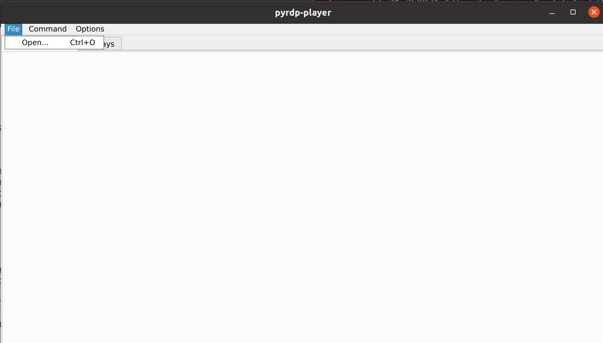
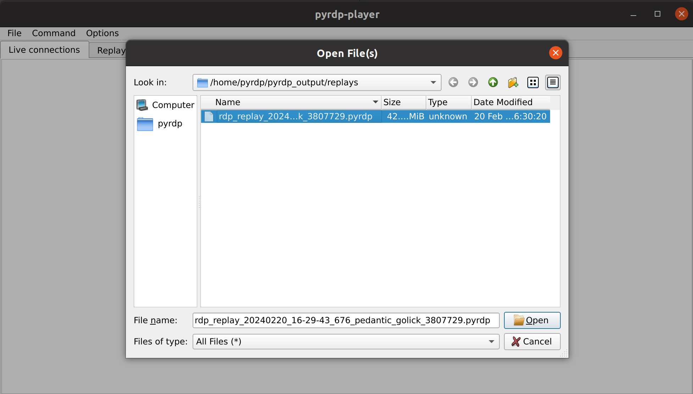
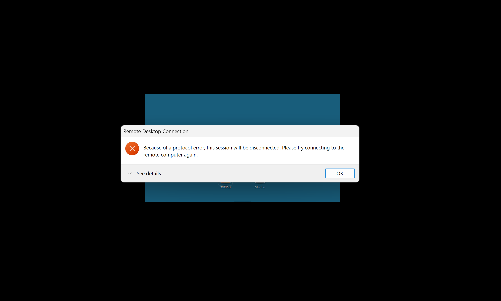
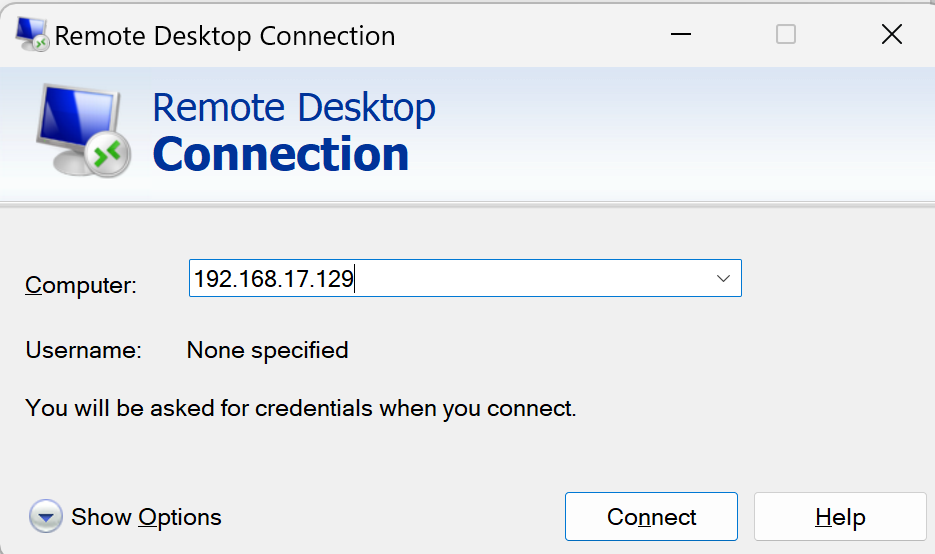
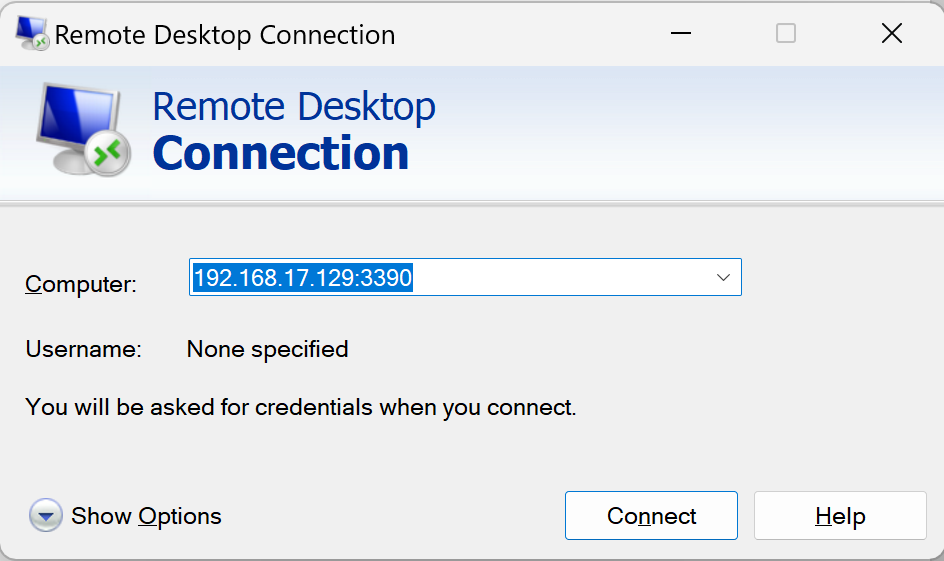
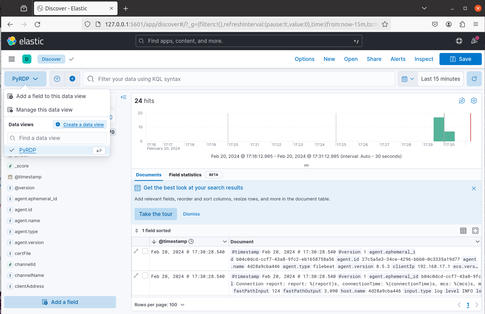

# A honeynet connected with Elasticstack
A docker-compose "project" for running several honeypots and log all the output in Elasticsearch.
 
This is done part of the CEH minor at NHL Stenden University of Applied Sciences, Emmen, The Netherlands.

## Components
* Docker Compose
* [Cowrie SSH/Telnet honeypot](https://github.com/cowrie/cowrie)
* [PyRdp honeypot (mitm tool)](https://github.com/GoSecure/pyrdp)
* [PyRdp honeypot (simulation) - *not fully working*](https://github.com/citronneur/rdpy)
* [DDosPot](https://github.com/aelth/ddospot)
* Elastic Stack
  * Elasticsearch
  * Kibana
  * Filebeat
  * Logstash

## System requirements
* 6-8GB RAM
* 40GB free Space

**Note!** This project was tested on Ubuntu 20.04

## How to build the environment
1. Update the package to the latest version

```bash
sudo apt update -y && sudo apt upgrade -y && sudo apt autoremove -y
```

2. Install Git

```bash
sudo apt install -y git
```

3. Install Docker

```bash
sudo apt install docker.io -y
```

4. Install Docker Compose

For Ubuntu use:

```bash
sudo apt install docker-compose -y
```

5. Clone this repository, and change to the directory

```bash
git clone https://github.com/Geniools/ceh-elastic-stack
cd ceh-elastic-stack
```

### Configure Cowrie

1. **(Optional)** Change the port number when logging in via SSH **(only if you plan to run Cowrie on the default SSH port: 22)**

```bash
sudo vim /etc/ssh/sshd_config
```

Find the line where `#Port 22` is written, and rewrite it as `Port 22222`

Reload ssh.service to reflect the change

```bash
sudo systemctl reload ssh
```

2. Create the file `cowrie.json` inside the `cowrie/log` directory. Afterwards give it the right permissions.

```bash
sudo touch cowrie.json
sudo chmod o+w cowrie.json
```

### Configure Filebeat

1. Give the right permissions to `filebeat.yml` inside the `filebeat/config` directory.

```bash
sudo chmod go-w filebeat.yml
```

### Configure PyRDP

There are two honeypots meant for RDP connections.

1. PyRDP from GoSecure

The first honeypot is runnig on the default port 3389, and requires an external Windows server with RDP enabled (for instance a Windows virtual machine). Check [this link](https://support.microsoft.com/en-us/windows/how-to-use-remote-desktop-5fe128d5-8fb1-7a23-3b8a-41e636865e8c#ID0EDD=Windows_10) on how to enable RDP on Windows 10 or 11.

Moreover, you will need to create a **.env** file at the root of the project and specify the *RDP_SERVER_IP* variable pointing to the IP address of the Windows server:

```dotenv
RDP_SERVER_IP=x.x.x.x
```

*Remember to replace 'x.x.x.x' with the real IP address of the server*

If the Windows server is not running on the default port 3389, you can add the actual port after the colon like this:

```dotenv
RDP_SERVER_IP=x.x.x.x:port
```

Afterwards, you can connect to the RDP server by specifying the IP address **of the linux server** running the hoenypot.


This honeypot is delivered together with the *PyRDP Player*, which is a GUI application meant to open and visualize the RDP connections captured by the hoenypot.
The player will run automatically when the docker cluster is started. To replay a connection use the *open* button inside the application as such:



 
2. RDPY honeypot

The second RDP honeypot will only display the login page of a fake Windows server, and then crash. Still, some information of the 'attacker' will be logged and saved to elasticsearch.



This honeypot *does* **not** *require* an additional RDP Windows server and runs on the custom port *3390*.

To connect to this honeypot, us the IP address of the Linux machine running the hoenypot, after which write the port 3390, such as:

```
x.x.x.x:3390
```

**Note!** To see both honeypots in action, you need to initiate an RDP connection to the Linux server running the docker containers!

### Build the environment

1. Build and run containers

```bash
sudo docker-compose up
```

You can run the containers as a daemon with the following command:

```bash
sudo docker-compose up -d
```

*The build might take up to 10-15 minutes!*

2. Access Kibana in your browser

You can access Kibana by going to `http://127.0.0.1:5601` in your browser. 


## Test logging and honeypot's reaction

1. Install NMAP to to a quick test attack

```bash
sudo apt install nmap
```

*After all the containers started and kibana is running you can test the logging:*

```bash
sudo nmap -A -T4 0.0.0.0
sudo nmap -sU 0.0.0.0
```

**For the RDP honeypots you will need connect using RDP from another Windows machine**




2. Go to **Analytics -> Discover** in order to view the logged data:

Create a new data view for each honeypot *(on the right you'll see "patterns" with the initialls of the honeypot)*. Create one data view for each honeypot.



### Data view indexes

| Honeypot  | Data view - source name  |
|:-:|---|
| Cowrie   | cowrie-yyyy.mm.dd  |
| PyRDP  | pyrdp-yyyy.mm.dd  |
| PyRDP Scenario (RDPY)  | default-yyyy.mm.dd  |
| DdosPot  | default-yyyy.mm.dd  |


**RDPY** *and* **DDosPot** *do not generate an unique field for filebeat to differentiate them, therefore both of them are within the* **default** *source pattern.*


## Video recordings

You can find video recordings of all the honeypots expected behaviour [here](./videos).
